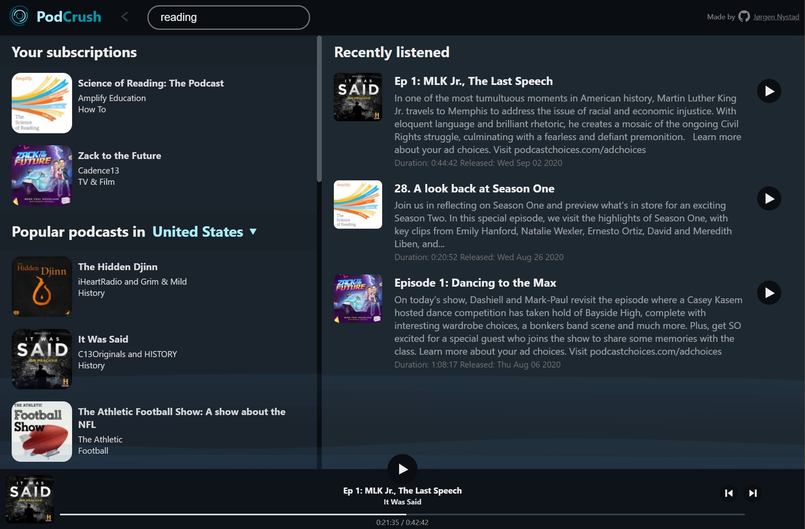

A Podcast player living in your browser. No accounts, no privacy invading tracking, no online persistence.

[Open PodCrush](https://podcrush.nystad.io/)

## Instructions

Run `npm install` to install dependencies before running.

### `npm start`

Runs the app in development mode. 
Open [http://localhost:3000](http://localhost:3000) to view it in the browser.
